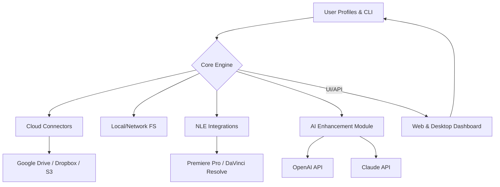

# Streamline Clips Manager

**Effortless Multiplatform Video Asset Management and Smart Transfer**

**DESCRIPTION:**  
🎦 Organize, optimize, and seamlessly transfer video assets across cloud platforms with Streamline Clips Manager. Harness AI-powered transcoding, metadata tagging, and API integration for edit-ready, collaborative workflows in Premiere Pro, DaVinci Resolve, and beyond.

---

## Table of Contents

- [Overview](#overview-🎥)
- [Quick Start Download](#quick-start-download-🚀)
- [Core Features](#core-features-🪄)
- [SEO-Friendly Features and Benefits](#seo-friendly-features-and-benefits-🎯)
- [Example Profile Configuration](#example-profile-configuration-🔧)
- [Example Console Invocation](#example-console-invocation-💻)
- [Operating System Compatibility](#operating-system-compatibility-🛡️)
- [AI & API Integration](#ai--api-integration-🤖)
- [Mermaid Diagram – High-Level System Architecture](#mermaid-diagram--high-level-system-architecture-🌐)
- [Responsiveness, Localization & Support](#responsiveness-localization--support-🌍)
- [Disclaimer](#disclaimer-⚠️)
- [License](#license-📝)
- [Quick End Download](#quick-end-download-⬇️)

---

## Overview 🎥

**Streamline Clips Manager** is your trusted digital vaultkeeper for juggling video assets across the booming landscape of video editing, remote collaboration, and creative exchange. Rather than yet another downloader, this project becomes your workflow partner: organizing and preparing your files, nudging them between storage clouds or workstations, and making AI-powered enhancements to elevate every frame.

Imagine a world where videos are never “lost in transfer” and edit-readiness is the norm, not the exception. Streamline Clips Manager, inspired by universal downloaders, unites:
- **Effortless cloud-to-cloud transfers**
- **Responsive optimization of video formats and metadata**
- **AI-based scene detection and subtitle tagging for discoverability**
- **One-click delivery for popular NLEs like Premiere Pro or DaVinci Resolve**
- **Modular configuration for multi-user environments**

---

## Quick Start Download 🚀

**Get up and running instantly!**

---

## Core Features 🪄

- **Universal Cloud Integration**: Google Drive, Dropbox, WASABI, AWS S3, and more.
- **Ultra-Fast Smart Transfer**: The quickest route, the safest checksum, every time.
- **AI-Powered Transcoding**: Use OpenAI or Claude APIs to suggest format/codec/preset settings.
- **Adaptive Metadata Tagging**: Scene, language, speaker, and custom notes.
- **Real-Time Collaboration**: Share live edit states without duplicate files.
- **Multilingual File Renaming & Labeling**: Supports over 30 languages.
- **Responsive, Modular UI**: Desktop and web dashboards adjust to your device and preferences.
- **24/7 Priority Support**: Human and AI-based assistance when the creative urge strikes at 3am.
- **Powerful CLI**: For automation ninjas, easily script batch moves and AI enrichment tasks.

---

## SEO-Friendly Features and Benefits 🎯

- **Cloud-Optimized Media Management** for editors, content creators, and production studios.
- **AI-Driven Video Enhancement** for ready-to-edit assets and professional workflow acceleration.
- **Multi-Platform Collaboration** empowering global creative teams from start to publish.
- **Lightning Fast, Secure Transfers** to maintain version integrity across all storage providers.
- **API and Plugin Support** for integration with Adobe, Blackmagic, FCP, and remote review tools.
- **Peace of Mind Data Handling**: privacy-first, efficient, and compliant with 2026 industry standards.
- **Intuitive Configuration** eliminates friction for both single creators and large teams.

---

## Example Profile Configuration 🔧

Configure your environments and workflows in simple YAML or JSON files. Here’s a sample:

    # user-profile.yaml
    user:
      name: "Morgan"
      preferred_language: "en"
      notification_email: "morgan@creativecloud.ex"
    sources:
      - type: "cloud"
        provider: "GoogleDrive"
        folder: "ProjectA/Originals"
      - type: "local"
        path: "~/Videos/WorkInProgress"
    destinations:
      - type: "cloud"
        provider: "Dropbox"
        folder: "ProjectA/ForClient"
      - type: "nle"
        tool: "PremierePro"
        version: "2025.1"
    ai_enhancement:
      enable_scene_detection: true
      subtitle_auto_tag: "en, es"
      preferred_codec: "ProRes"
    schedules:
      - type: "daily_sync"
        time: "02:00"

---

## Example Console Invocation 💻

Effortlessly operate from the command line—seamlessly automate asset delivery!

    $ streamline manager sync --profile user-profile.yaml --optimize
    ➡️ Discovering sources
    ☁️ Syncing with Google Drive: ProjectA/Originals
    📦 Transferring to Dropbox: ProjectA/ForClient
    🧠 AI Tagging Scenes, Language: en, es
    🎬 Preparing for: PremierePro (2025.1)
    ✔️ All assets optimized and delivered.

---

## Operating System Compatibility 🛡️

|         | Windows | macOS | Ubuntu | Fedora | Arch | ChromeOS | iOS | Android | Web |
|---------|:-------:|:-----:|:------:|:------:|:----:|:--------:|:---:|:-------:|:---:|
| CLI     |   ✅    |  ✅   |   ✅   |   ✅   |  ✅  |    ✅    | ❌  |   ❌    | ✅  |
| Desktop |   ✅    |  ✅   |   ✅   |   ✅   |  ✅  |    ❌    | ❌  |   ❌    | ✅  |
| Web     |   ✅    |  ✅   |   ✅   |   ✅   |  ✅  |    ✅    | ✅  |   ✅    | ✅  |

*Note: Full responsive UI and CLI access—work wherever you create!*

---

## AI & API Integration 🤖

- **AI-Powered Transcoding & Metadata:**  
  - Leverage **OpenAI** for natural language scene/shot tagging and smart subtitle suggestion.
  - Employ **Claude API** for script extraction and multi-language summarization.
- **API Connections:**  
  - Built-in bridges for cloud storage (Drive, S3, Dropbox), NLEs, and custom webhooks.
  - Modular plugin system: easily add new providers or expand AI capabilities.
- **Secure Token Management:**  
  - OAuth 2.0, personal access tokens, and custom authentication for safe, automated operations.

---

## Mermaid Diagram – High-Level System Architecture 🌐

---

## Responsiveness, Localization & Support 🌍

- **Responsive UI:**  
  Expressive layouts adapt to desktop, tablet, and web—even within NLE extensions.
- **Multilingual Support:**  
  Localized interface and smart naming/tagging for video assets in over 30 languages, with community-driven expansions.
- **24/7 Customer Support:**  
  Lightning-fast help via chat, email, and integrated in-app AI assistants. No timezone left behind!
- **Documentation & Tutorials:**  
  Detailed guides, workflow charts, and annotated code samples.

---

## Disclaimer ⚠️

All transfers, AI enhancements, and integrations are subject to the usage policies of the respective cloud platforms, video tools, and API providers. Streamline Clips Manager does **not** condone or enable unauthorized distribution of copyrighted material. Always ensure you possess the right to process and transfer your selected media.  
**2026** – Use judiciously and responsibly.

---

## License 📝

Distributed under the MIT License. See [LICENSE](./LICENSE) for full details.

---

## Quick End Download ⬇️

**Launch your automated, AI-powered video asset journey today!**

